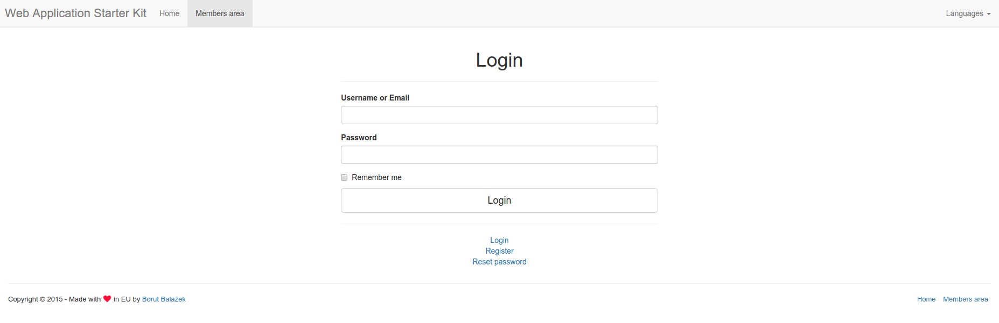
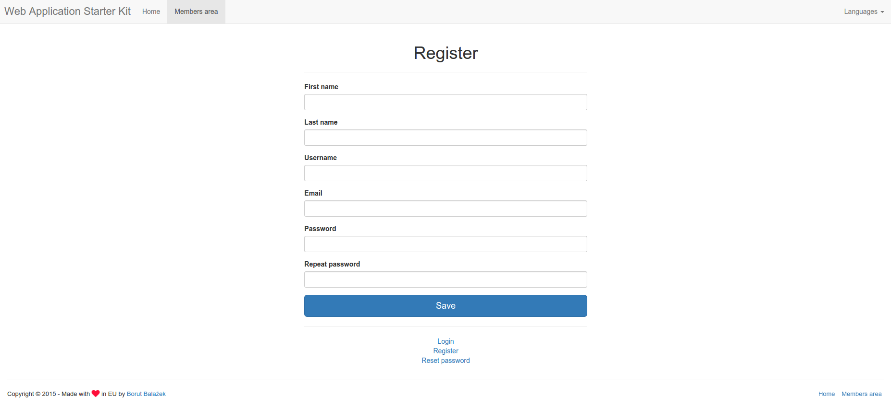
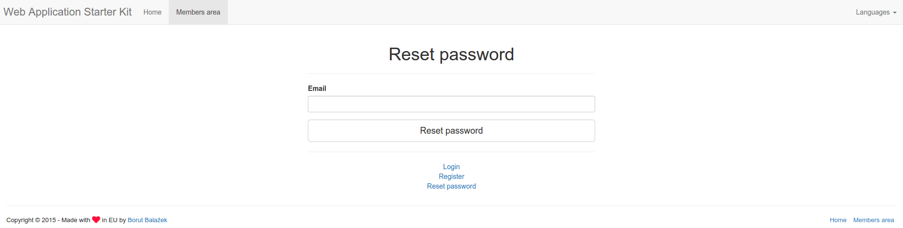
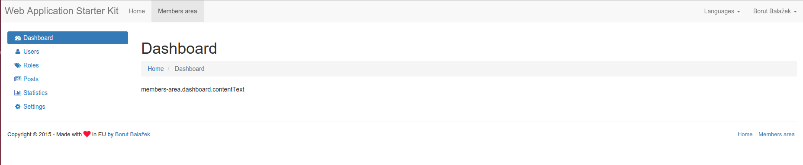
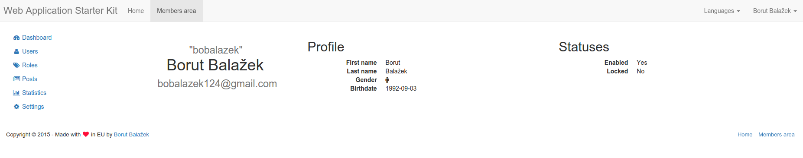
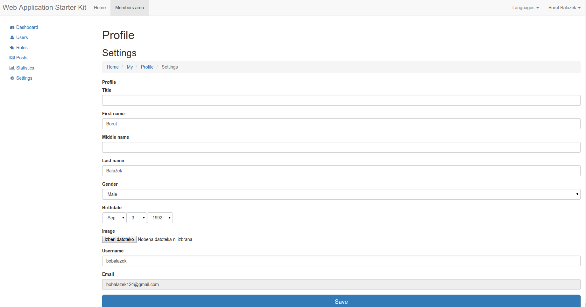
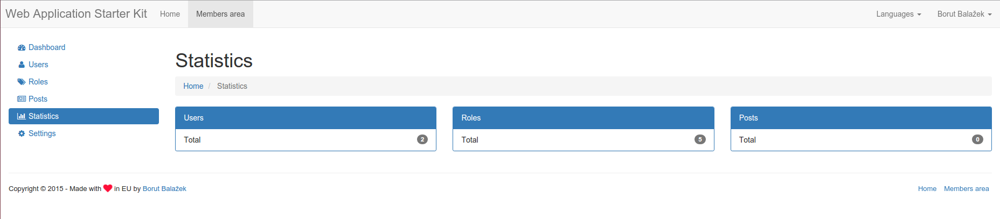
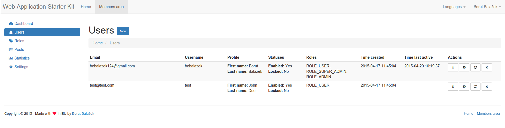
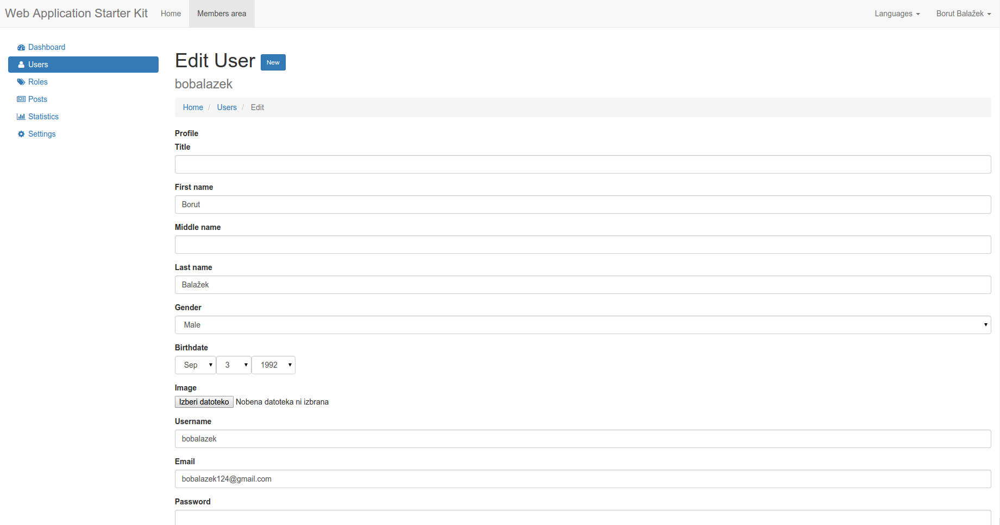

README
======
**Web Application Starter Kit**

An simple web application boilerplate for min or mid scale applications. Included user system (login, logout, register, forgotten password, profile, edit profile and change password), users, roles, simple statistics and more.

Build status
-------------------

Requirements & Tools & Helpers
-------------------
* PHP > 5.3.9
* [Composer](https://getcomposer.org/) *
* [Bower](http://bower.io/) *
* [PHP Coding Standards Fixer](http://cs.sensiolabs.org/)

Setup / Development
-------------------
* Navigate yor your web directory: `cd /var/www`
* Create a new project: `composer create-project bobalazek/web-application-starter-kit --no-scripts`
* Configure database (and maybe other stuff if you want): [app/configs/global.php](https://github.com/bobalazek/web-application-starter-kit/blob/master/app/configs/global.php#L47) or [app/configs/global-local.php.dist](https://github.com/bobalazek/web-application-starter-kit/blob/master/app/configs/global-local.php.dist) (in case you will deploy it and need a different local configuration. Just rename the global-local.php.dist to global-local.php and set your own configuration)
* Run the following commands:
    * `composer install`
    * `bin/console orm:schema-tool:install --force` (to install the database schema)
    * `bower update` (to install the front-end dependencies - you will need to install [Bower](http://bower.io/) first - if you haven't already)
    * `bin/console application:database:hydrate-data` (to hydrate some data)
* You are done! Start developing!

Database
-------------------
* We use the Doctrine database
* Navigate to your project directory: `cd /var/www/my-app`
* Check the entities: `bin/console orm:info` (optional)
* Update the schema: `bin/console orm:schema-tool:update --force`
* Database updated!

Application name
-------------------
You should replace the name for your actual application inside the following files:

* README.md
* bower.json
* composer.json
* phpunit.xml
* app/configs/global.php

Administrator login
-------------------
With the `bin/console application:database:hydrate-data` command, you will, per default hydrate 2 users (which you can change inside the `app/fixtures/users.php` file):

* Admin User (with admin permissions)
    * Username: `admin` or `admin@myapp.com`
    * Password: `test`
* Test User (with the default user permissions)
    * Username: `test` or `test@myapp.com`
    * Password: `test`

Commands
--------------------
* `bin/console application:environment:prepare` - Will create the global-local.php and development-local.php files (if they do not exist)
* `bin/console application:database:hydrate-data [-r|--remove-existing-data]` - Will hydrate the tables with some basic data, like: 2 users and 6 roles (the `--remove-existing-data` flag will truncate all tables before re-hydrating them)
* `bin/console application:storage:prepare` - Will prepare all the storage (var/) folders, like: cache, logs, sessions, etc.
* `bin/console application:translations:prepare` - Prepares all the untranslated string into a separate (app/locales/{locale}_untranslated.yml) file. Accepts an locale argument (defaults to 'en_US' - usage: `bin/console application:translations:prepare --locale de_DE` or `bin/console application:translations:prepare -l de_DE` )

Other commands
----------------------
* `sudo php-cs-fixer fix .` - if you want your code fixed before each commit. You will need to install [PHP Coding Standards Fixer](http://cs.sensiolabs.org/)

Modules / Components
-------------------
In case you want to create a new component / module in this system, do the following (in this case, the posts inside the members area):

* Create a new Controller Provider (like [src/Application/ControllerProvider/MembersArea/PostsControllerProvider.php](https://github.com/bobalazek/web-application-starter-kit/blob/master/src/Application/ControllerProvider/MembersArea/PostsControllerProvider.php) - plural)
    * Bind with the following routes:
        * Overview / list:
            * Route name: [members-area.posts](https://github.com/bobalazek/web-application-starter-kit/blob/master/src/Application/ControllerProvider/MembersArea/PostsControllerProvider.php#L18)
            * Route pattern / url: [(blank)](https://github.com/bobalazek/web-application-starter-kit/blob/master/src/Application/ControllerProvider/MembersArea/PostsControllerProvider.php#L15)
            * Route controller method: [PostsController::indexAction](https://github.com/bobalazek/web-application-starter-kit/blob/master/src/Application/Controller/MembersArea/PostsController.php#L11)
        * New:
            * Route name: [members-area.posts.new](https://github.com/bobalazek/web-application-starter-kit/blob/master/src/Application/ControllerProvider/MembersArea/PostsControllerProvider.php#L24)
            * Route pattern / url: [/new](https://github.com/bobalazek/web-application-starter-kit/blob/master/src/Application/ControllerProvider/MembersArea/PostsControllerProvider.php#L21)
            * Route controller method: [PostsController::newAction](https://github.com/bobalazek/web-application-starter-kit/blob/master/src/Application/Controller/MembersArea/PostsController.php#L24)
        * Detail:
            * Route name: `members-area.posts.detail`
            * Route pattern / url: `/{id}`
            * Route controller method: `PostsController::detailAction`
        * Edit:
            * Route name: [members-area.posts.edit](https://github.com/bobalazek/web-application-starter-kit/blob/master/src/Application/ControllerProvider/MembersArea/PostsControllerProvider.php#L30)
            * Route pattern / url: [/{id}/edit](https://github.com/bobalazek/web-application-starter-kit/blob/master/src/Application/ControllerProvider/MembersArea/PostsControllerProvider.php#L27)
            * Route controller method: [PostsController::editAction](https://github.com/bobalazek/web-application-starter-kit/blob/master/src/Application/Controller/MembersArea/PostsController.php#L91)
        * Remove:
            * Route name: [members-area.posts.remove](https://github.com/bobalazek/web-application-starter-kit/blob/master/src/Application/ControllerProvider/MembersArea/PostsControllerProvider.php#L36)
            * Route pattern / url: [/{id}/remove](https://github.com/bobalazek/web-application-starter-kit/blob/master/src/Application/ControllerProvider/MembersArea/PostsControllerProvider.php#L33)
            * Route controller method: [PostsController::removeAction](https://github.com/bobalazek/web-application-starter-kit/blob/master/src/Application/Controller/MembersArea/PostsController.php#L156)
* Create a new Controller ([src/Application/Controller/MembersArea/PostsController.php](https://github.com/bobalazek/web-application-starter-kit/blob/master/src/Application/Controller/MembersArea/PostsController.php) - plural)
    * With the following methods:
        * [PostsController::indexAction](https://github.com/bobalazek/web-application-starter-kit/blob/master/src/Application/Controller/MembersArea/PostsController.php#L11) - for the list template
        * [PostsController::newAction](https://github.com/bobalazek/web-application-starter-kit/blob/master/src/Application/Controller/MembersArea/PostsController.php#L33) - for the new templates
        * `PostsController::detailAction` - for the details template
        * [PostsController::editAction](https://github.com/bobalazek/web-application-starter-kit/blob/master/src/Application/Controller/MembersArea/PostsController.php#L91) - for the edit template
        * [PostsController::removeAction](https://github.com/bobalazek/web-application-starter-kit/blob/master/src/Application/Controller/MembersArea/PostsController.php#L156) - for the remove template
* Mount the routes of the Controller Provider to the routes ([app/core/routes.php](https://github.com/bobalazek/web-application-starter-kit/blob/master/app/core/routes.php#L33))
* Create a new Entity ([src/Application/Entity/PostEntity.php](https://github.com/bobalazek/web-application-starter-kit/blob/master/src/Application/Entity/PostEntity.php) - singular)
* Create a new Repository ([src/Application/Repository/PostRepository.php](https://github.com/bobalazek/web-application-starter-kit/blob/master/src/Application/Repository/PostRepository.php) - singular)
* Create a new Form Type ([src/Application/Form/Type/PostType.php](https://github.com/bobalazek/web-application-starter-kit/blob/master/src/Application/Form/Type/PostType.php) - singular)
* Create templates:
    * app/templates/contents/members-area/posts/ (plural)
    	* [index.html.twig](https://github.com/bobalazek/web-application-starter-kit/blob/master/app/templates/contents/members-area/posts/index.html.twig) (normally just extends the list.html.twig)
        * [list.html.twig](https://github.com/bobalazek/web-application-starter-kit/blob/master/app/templates/contents/members-area/posts/list.html.twig)
        * `detail.html.twig`
        * [new.html.twig](https://github.com/bobalazek/web-application-starter-kit/blob/master/app/templates/contents/members-area/posts/new.html.twig)
        * [edit.html.twig](https://github.com/bobalazek/web-application-starter-kit/blob/master/app/templates/contents/members-area/posts/edit.html.twig)
        * [remove.html.twig](https://github.com/bobalazek/web-application-starter-kit/blob/master/app/templates/contents/members-area/posts/remove.html.twig)
        * [_form.html.twig](https://github.com/bobalazek/web-application-starter-kit/blob/master/app/templates/contents/members-area/posts/_form.html.twig) (just include that inside the edit and new template, so you don't need to write the same form twice - if it's more complex)

File structure
----------------------
* app/
    * configs/ => All basic config stuff (+ validation)
    * core/ => The core files such as providers, routes, middlewares, common functions and definitions
    * fixtures/ => Used when hydrating the database
    * locales/ => Translations & co.
    * templates/ => All twig templates
* bin/
    * console
* src/
    * Application/
        * Command/
        * Controller/
        * ControllerProvider/
        * Doctrine/ => Some Doctrine fixes for Silex
        * Entity/ => All entities / models
        * Form/
        * Provider/
        * Repository/
        * Tool/
        * Twig/
* web/
    * assets/
        * images/
        * javascripts/
        * uploads/ => Used for uploads
        * vendor/ => Bower dependencies
    * index.php

Preview
----------------------

### Login ###

### Register ###

### Reset password ###

### Dashboard ###

### Profile ###

### Profile settings ###

### Statistics ###

### Users ###

### Users edit ###

License
----------------------
Web Application Starter Kit is licensed under the MIT license.
