README
======
**Contest-O-Mat**

An simple contest / prize game application starter kit.

Features
-------------------
* **Users System**: You and your client (owner of the prizegame) can create unlimited users and each user can have separate permissions for each functionality (to view, create or edit users, roles, participants, entries, votes, winners and statistics). Each user can also register by themselves (if enabled). The system has also already integrated the reset password functionality for users.
* **Participants**: Each visitor that participates in your prize game / sweepstakes.
* **Entries**: If the participant can participate multiple times in the prize game / contest then the participant is entered only once and for each participation an "entry" is created (because it does not make sense to always create a new participant for each time the visitor participates).
* **Votes**: In case you want the visitors to enable voting on the entries.
* **Winners**: You can hand pick the winning participants and entries which will then be shown on a separate page.
* **Statistics**: To have the complete overview of your application. You are able to see the participants, entries, votes and visits (if Piwik is enabled) by:
    * last 48 hours,
    * last 30 days,
    * browsers,
    * operating systems,
    * device types,
    * devices,
    * cities and
    * countries.
* **Settings**: Most of the settings can be edited via the administration.

Build status
-------------------

Requirements & Tools & Helpers
-------------------
* PHP > 5.4
* [Composer](https://getcomposer.org/)
* [Bower](http://bower.io/)
* [PHP Coding Standards Fixer](http://cs.sensiolabs.org/) (optional)

Setup
-------------------
* Navigate yor your web directory: `cd /var/www`
* Create a new project: `composer create-project bobalazek/contest-o-mat --no-scripts`
* Configure database (and maybe other stuff if you want): [app/configs/global.php](https://github.com/bobalazek/contest-o-mat/blob/master/app/configs/global.php#L47) or [app/configs/global-local.php.dist](https://github.com/bobalazek/contest-o-mat/blob/master/app/configs/global-local.php.dist) (in case you will deploy it and need a different local configuration. Just rename the global-local.php.dist to global-local.php and set your own configuration)
* Run the following commands:
    * `composer install`
    * `bin/console orm:schema-tool:install --force` (to install the database schema)
    * `bower update` (to install the front-end dependencies - you will need to install [Bower](http://bower.io/) first - if you haven't already)
    * `bin/console application:database:hydrate-data` (to hydrate some data)
* You are done! Start developing!

Database
-------------------
* We use the Doctrine database
* Navigate to your project directory: `cd /var/www/my-app`
* Check the entities: `bin/console orm:info` (optional)
* Update the schema: `bin/console orm:schema-tool:update --force`
* Database updated!

Development
-------------------
Important files / directory you may want / need to edit when developing your application:

* Config: `app/configs/global.php` (just open the file and view it yourself. There are MANY settings you may want to tweak)
* Middlewares: `app/core/middlewares.php` (you may want to take a deeper look into the "User UID" part - line 115. and below)
* HTML Templates: `app/templates/contents/application/`
* Javascripts: `web/assets/javascripts/contest.js`
* Stylesheets: `web/assets/stylesheets/contest.css`
* Participate Form Type: `src/Application/Form/Type/Participate/DefaultType.php` (the form, which shows up at the participation)
* Application Controller: `src/Application/Controller/ApplicationController.php` (all the contest logic, handling and persistence goes here)
* Application Controller Provider: `src/Application/ControllerProvider/ApplicationControllerProvider.php`  (the contest routes are here)

Application name
-------------------
You should replace the name for your actual application inside the following files:

* `README.md`
* `bower.json`
* `composer.json`
* `phpunit.xml`
* `app/configs/global.php`

Administrator login
-------------------
With the `bin/console application:database:hydrate-data` command, you will, per default hydrate 2 users (which you can change inside the `app/fixtures/users.php` file):

* Admin User (with admin permissions)
    * Username: `admin` or `admin@myapp.com`
    * Password: `test`
* Test User (with the default user permissions)
    * Username: `test` or `test@myapp.com`
    * Password: `test`

Commands
--------------------
* `bin/console application:environment:prepare` - Will create the global-local.php and development-local.php files (if they do not exist)
* `bin/console application:database:hydrate-data [-r|--remove-existing-data]` - Will hydrate the tables with some basic data, like: 2 users and 6 roles (the `--remove-existing-data` flag will truncate all tables before re-hydrating them)
* `bin/console application:storage:prepare` - Will prepare all the storage (var/) folders, like: cache, logs, sessions, etc.
* `bin/console application:translations:prepare` - Prepares all the untranslated string into a separate (app/locales/{locale}_untranslated.yml) file. Accepts an locale argument (defaults to 'en_US' - usage: `bin/console application:translations:prepare --locale de_DE` or `bin/console application:translations:prepare -l de_DE` )

Other commands
----------------------
* `sudo php-cs-fixer fix .` - if you want your code fixed before each commit. You will need to install [PHP Coding Standards Fixer](http://cs.sensiolabs.org/)

Preview
----------------------

### Application - Index ###
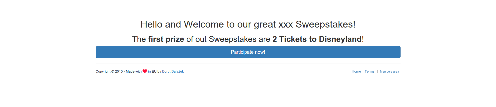

### Application - Participate ###
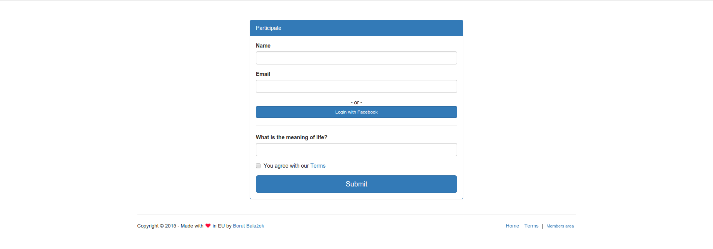

### Members Area - Entries ###
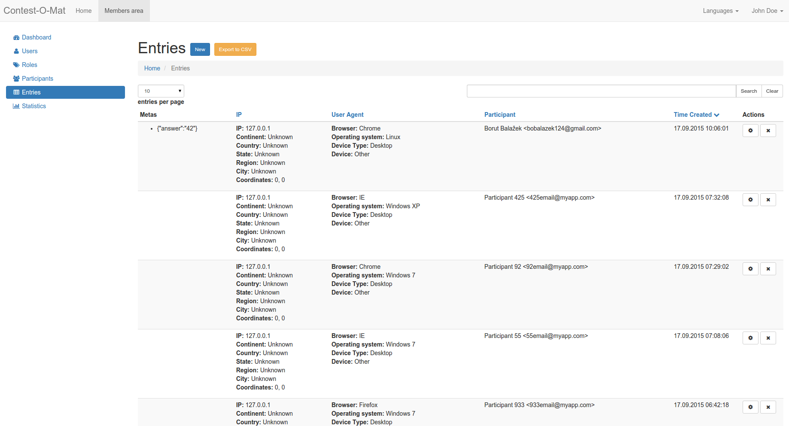

### Members Area - Participants ###
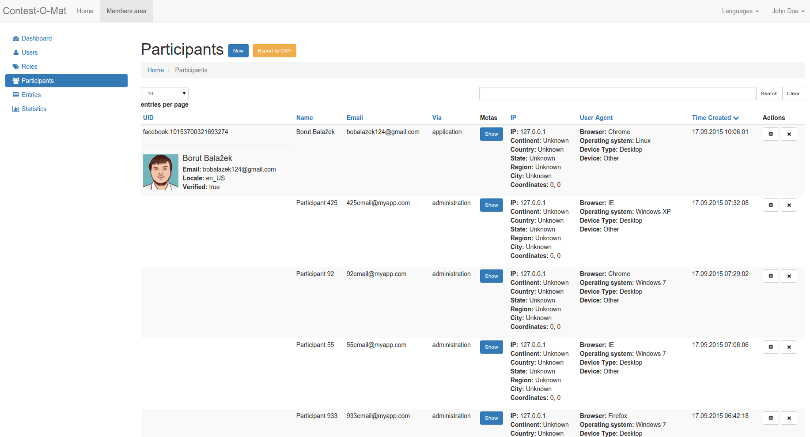

### Members Area - Participants - Metas Modal ###
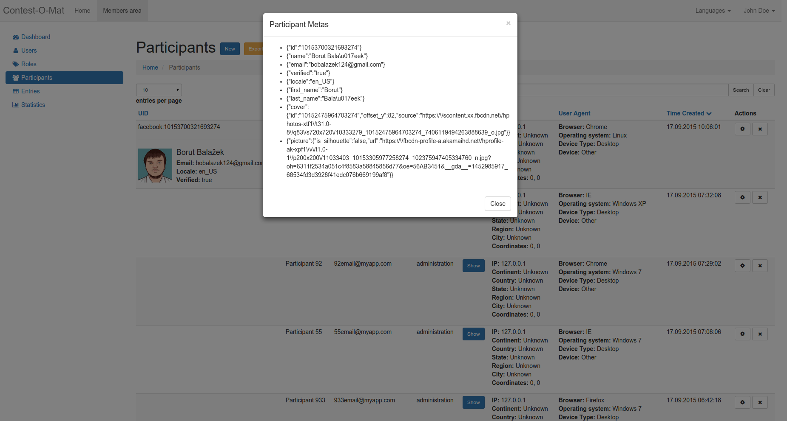

### Members Area - Participants - Edit ###
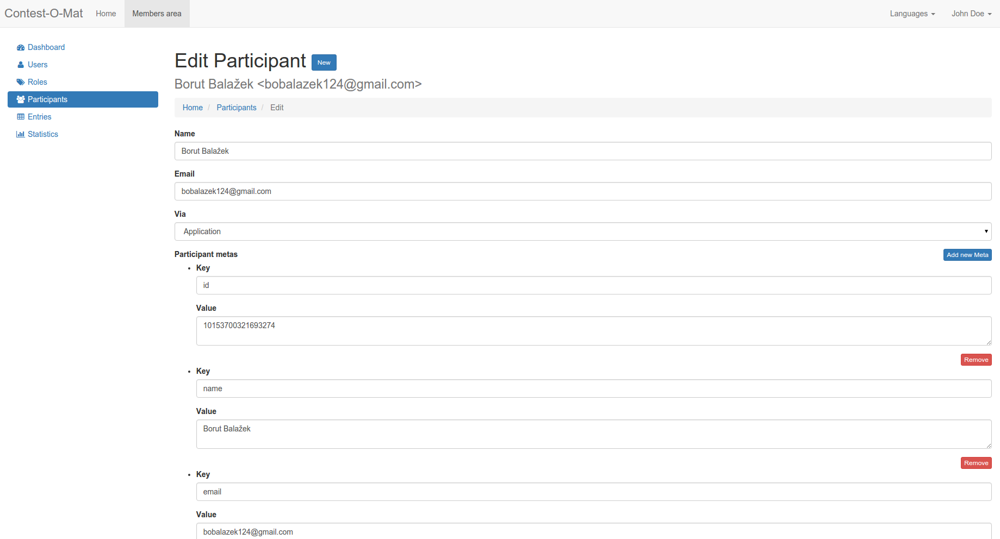

### Members Area - Votes ###
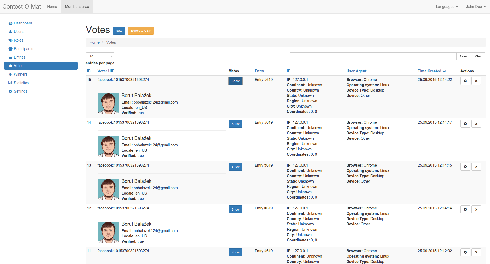

### Members Area - Winners ###
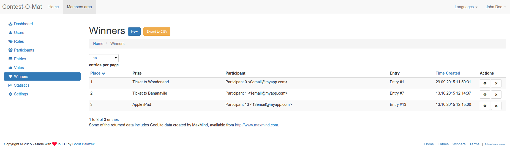

### Members Area - Statistics ###
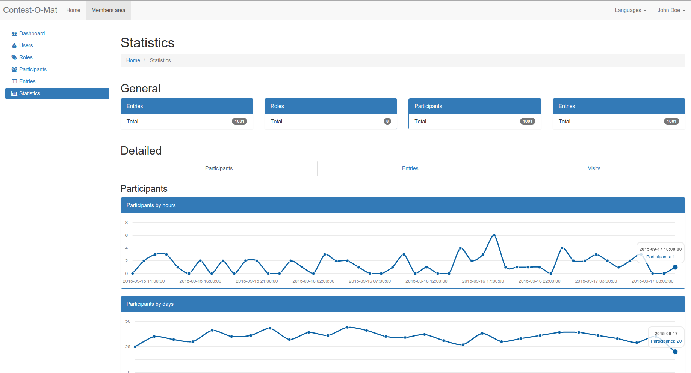

### Members Area - Statistics (more) ###
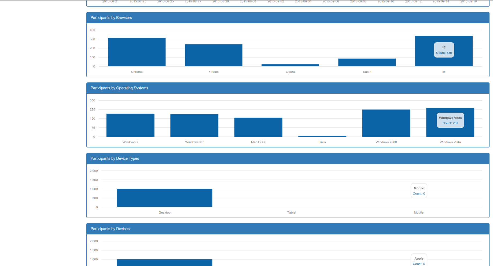

### Members Area - Statistics (more) ###
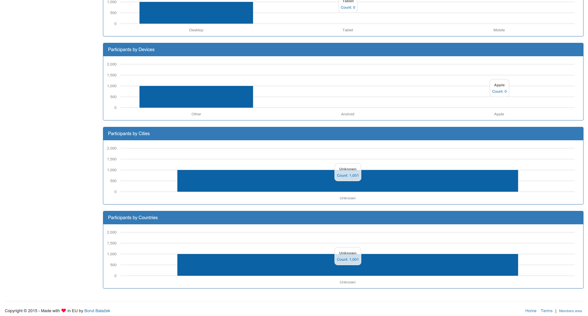

### Members Area - Statistics - Visits ###
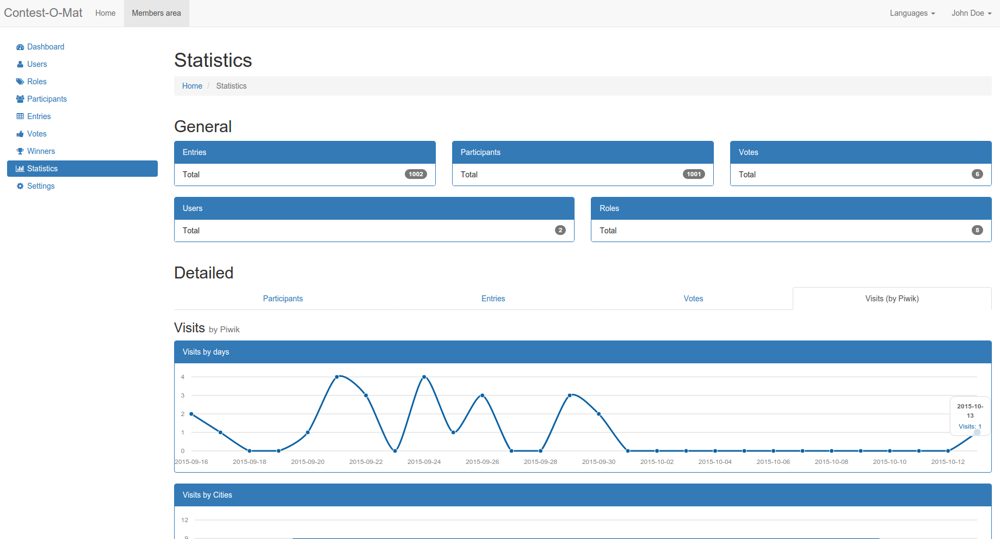

### Members Area - Settings ###
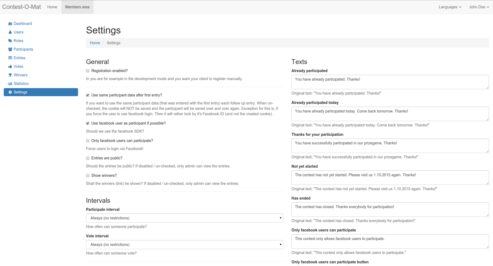

License
----------------------
Contest-O-Mat is licensed under the MIT license.
